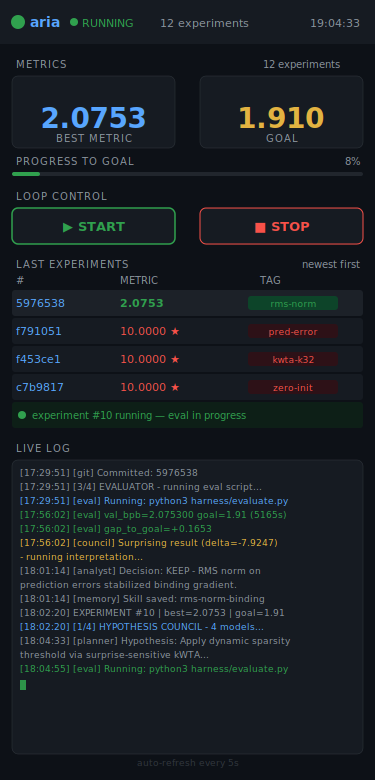

<div align="center">


**Autonomous Research Intelligence Agent**

*An overnight ML experiment engine with a multi-model council, persistent memory, and explicit stop conditions that write a conclusion — then exit.*

[](LICENSE)
[](https://www.python.org/)
[](providers.py)
[](CONTRIBUTING.md)

</div>

---

<div align="center">



*Live experiment dashboard — monitor and control from your phone while ARIA runs overnight*

</div>

---

## What is ARIA?

ARIA is a self-running ML research loop. You give it a model file, an eval script, and a goal metric. It proposes hypotheses, implements them one at a time, evaluates, keeps what works, discards what doesn't — and stops only when it can write a proof.

```
You sleep. ARIA runs. You wake up to a conclusion.
```

Not a chatbot wrapper. Not a scheduler. A research loop with:
- **5-persona model council** — Neuroscientist, Skeptic, Theorist, Engineer, Maverick each propose independently. Chairman synthesizes.
- **Three-level memory** — skills accumulate across experiments. ARIA never proposes what already failed.
- **GEPA-lite constitution** — every N experiments, the Evolver rewrites `AGENT.md` from accumulated learnings. ARIA gets smarter the longer it runs.
- **Hard stop conditions** — exits cleanly with a structured `CONCLUSION.md` when the goal is reached, a ceiling is found, or a mechanism is confirmed.

---

## Quickstart

```bash
git clone https://github.com/ashy5454/aria
cd aria
pip install httpx pyyaml

# Pick one provider and set its key:
export GEMINI_API_KEY=your_key       # provider: gemini  (pip install google-genai)
export OPENROUTER_API_KEY=your_key   # provider: openrouter — GPT-4o, Claude, Llama, Mistral...
export OPENAI_API_KEY=your_key       # provider: openai

python loop_v2.py
```

**Overnight on a VM:**

```bash
tmux new -s aria
python loop_v2.py
# Ctrl+B D  →  detach, go to sleep
# tmux attach -t aria  →  check in the morning
```

**Phone dashboard:**

```bash
bash dashboard/start.sh
# → http://YOUR_VM_IP:8080   PIN: 1234
```

---

## The loop

```
┌─────────────────────────────────────────────────────────┐
│                        COUNCIL                          │
│  Neuroscientist · Skeptic · Theorist · Engineer · Maverick  │
│         5 independent proposals → Chairman synthesis    │
└───────────────────────┬─────────────────────────────────┘
                        │  one hypothesis
                        ▼
                    ┌───────┐
                    │ CODER │  implements ONE change in your model file
                    └───┬───┘
                        │
                        ▼
                    ┌───────┐
                    │  EVAL │  runs your eval script · parses metric from stdout
                    └───┬───┘
                        │
                        ▼
                  ┌──────────┐
                  │ ANALYST  │  keep or discard · writes skill file to memory
                  └────┬─────┘
                       │
          ┌────────────┼────────────┐
          │            │            │
    goal crossed   20 fails    mechanism
    ▼               ▼         confirmed ▼
CONCLUSION.md  CONCLUSION.md  CONCLUSION.md
GOAL ACHIEVED  CEILING FOUND  PROVEN 3×
```

Every **N experiments** — the Evolver rewrites `AGENT.md` from what memory has learned.

---

## Adapting to your research

Three files. That's it.

### `research.yaml`

```yaml
project:
  name: "Your Research Project"

model:
  file: "solutions/your_model.py"   # the ONE file agents edit

eval:
  script: "harness/evaluate.py"
  metric: "val_loss"
  direction: "lower"                # or "higher"
  goal: 1.91                        # ARIA exits when this is crossed

domain:
  context: |
    What this model is. What the architectural levers are.
    What must never be changed. More specific = better hypotheses.
```

### `eval.py`

Any script. One line to stdout:

```python
print(f"step=5000  train=0.031  eval={result:.4f}")
#                                    ^^^^
#                         ARIA reads this key
```

### `AGENT.md`

The research constitution — what can be changed, what cannot, what the model is trying to do. Written by you. Rewritten by the Evolver.

See [`examples/mnist_lr_search/`](examples/mnist_lr_search/) for a complete working example.

---

## The council

| Persona | Frame |
|---|---|
| Neuroscientist | grounds hypotheses in biological neural circuits |
| Skeptic | most conservative — highest probability of working |
| Theorist | information theory, representational geometry, capacity |
| Engineer | gradient flow, initialization, numerical stability |
| Maverick | counterintuitive angles — wrong more often, but breakthroughs when right |
| **Chairman** | stress-tests all five, synthesizes the strongest hypothesis |

Works with any provider — set `provider:` in `research.yaml` to `gemini`, `openrouter`, or `openai`.

---

## Stop conditions

ARIA writes `results/CONCLUSION.md` and exits cleanly:

| Condition | Trigger | CONCLUSION.md says |
|---|---|---|
| Goal achieved | metric crosses `eval.goal` | `PROVEN: mechanism X drove val_loss Y → Z` |
| Ceiling found | N consecutive experiments with no improvement | `HYPOTHESIS: architectural bottleneck at X` |
| Mechanism confirmed | same tag improved in N independent experiments | `PROVEN: sparsity reduces interference — confirmed 3×` |

Structured as **PROVEN / HYPOTHESIS / SPECULATION** — the same epistemic separation a paper uses.

---

## Memory

```
wiki/
  session.db   WAL SQLite + FTS5    all agent turns, searchable within session
  skills.db    FTS5 skill index     searchable across all experiments
  skills/      YAML + Markdown      survive VM restarts, git-committable
```

The Planner searches skill memory before every hypothesis. ARIA never proposes what already failed.

---

## File layout

```
loop_v2.py              main research loop (config-driven)
memory.py               three-level memory layer
hypothesis_council.py   5-persona council + chairman (provider-agnostic)
research.yaml           your config — swap per project
AGENT.md                research constitution — evolved every N experiments

harness/
  evaluate.py           immutable eval harness

solutions/
  cmp_current.py        example model (replace with yours)

results/
  results.tsv           one row per experiment
  session.log           timestamped run log
  CONCLUSION.md         written on stop condition

wiki/
  session.db / skills.db / skills/

dashboard/
  api.py                Flask server
  static/index.html     phone-optimized UI

examples/
  mnist_lr_search/      complete worked example
```

---

## Inspired by

- [Andrej Karpathy](https://github.com/karpathy) — fixed-budget research loop, keep/discard pattern
- [NousResearch/hermes-agent](https://github.com/NousResearch) — three-level memory, GEPA constitution evolution
- [karpathy/llm-council](https://github.com/karpathy) — multi-model independent proposal + synthesis
- [CTS by Yudi Labs](https://github.com/ashy5454) — conversation-type routing and session memory layer

---

## Contributing

See [CONTRIBUTING.md](CONTRIBUTING.md). New domain examples are the most valuable contribution — if you ran ARIA on a vision model, an RL agent, or anything outside language modeling, open a PR.

## License

MIT
